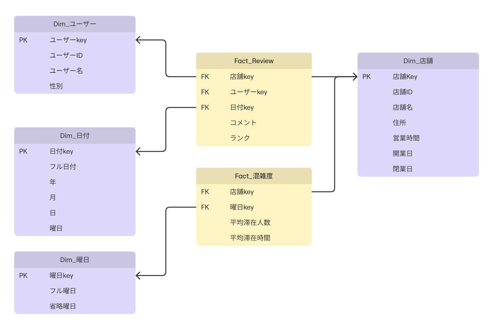
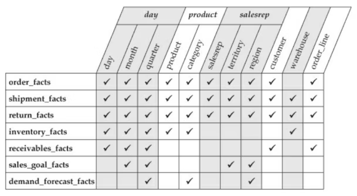

# 若葉マークのディメンショナルモデリング

ビジネスプロセスが蓄積する「ファクトテーブル」と、分析軸である「ディメンションテーブル」からなる「スタースキーマ」を基本とするモデリングの手法。

ディメンショナル・モデリングは、ビジネスプロセス(fact)を文脈(dimention)によってモデル化することにより、分析可能にする。

## ファクトテーブル

* ディメンションテーブルへの外部キーといくつかの測定項目で構成される
* ビジネスプロセスにおけるイベントの最小粒度
* 時系列でデータが蓄積される
* 集計できるように加算できる数値が望ましい
* 大量のレコード数、少ない項目数

## ディメンションテーブル

* 1つのキーについて、ビジネスにおける属性が記録される
* ファクトに対するフィルタリングや集計範囲の制御、順序付け、グルーピングの軸となる(5W1H)
* クエリの効率化(主にjoinの削減)のために第三正規化までは行わない
    * 正規化したものはスノーフレークスキーマと呼ぶ
* 少ないレコード数、多数の項目数

### ビジネスプロセスって？

「ビジネス観点で」集計・分析したいこと。意思決定のインプットになりそうなこと。

### 粒度って？

ファクトテーブルにおける1行が発生する単位(タイミング、状況)のこと。1行のなかにバラバラの粒度の項目が混じっていると、nullが含まれたり、意味がばらけて認知負荷が高くなったりしてつらい。

ファクトの粒度はディメンションで定義する。

あと、ファクトが複数ある場合、粒度が揃っているとレポートやアプリとして直感的に使いやすくなる。

### クエリはどうなる？

フィルタリングしたい条件に合わせて、where句を適用したディメンションとファクトをjoinする。

なので、ディメンションとファクトの関係度は1対Nになるように設計する必要がある。

## 設計パターン、設計手法

* スローチェンジディメンション(SCD)
    * ディメンションの属性の更新を時間の経過と合わせて管理するため、主キーにナチュラルキーではなくサロゲートキーを採用する手法
    * state/endの日時をいれてバージョン管理したり、シンプルに最新レコード=最新として保持したり

* コンフォームド(適用)ディメンション
    * 複数のファクトやディメンションとjoin可能なディメンションのこと
    * いくつかパターンがある
        * Shared Dimention(複数のファクトで共有するディメンション)
        * Conformed Rollup(一部、同じ構造を持つこと)
        * Conforming Degenerate Dimensions(ファクトテーブルのなかにディメンションを持つこと)

* 複数スタースキーマ
    * ファクトはビジネスプロセス(発生タイミング)ごとにわける
    * 複数のファクトを結合する場合、ディメンションに対するファクトの関係度(1対多、1対1とか)を間違えると不正な結果(ファントラップ)になることがあるため、ドリルアクロスなど正しい手順による結合が必要
    * 多対多のディメンションやファクトが発生した場合はブリッジテーブルを使って階層化する
    * 

* 適合マトリクス

    
    https://qiita.com/aki_naka/items/eac59ce35de7673b6b23

# 参考

* [ディメンショナルモデリング](https://zenn.dev/pei0804/articles/dimensional-modeling)
* [DWHにおけるデータモデリング](https://speakerdeck.com/ryotas_data/dwhniokerudetamoderu-ding-fan-karazui-xin-torendomade?slide=52)
* [スタースキーマ(基礎)](https://zenn.dev/pei0804/articles/star-schema-design)
* [複数スタースキーマ](https://zenn.dev/pei0804/articles/multiple-star-schema)
* [適合ディメンション](https://zenn.dev/pei0804/articles/conformed-dimensions)
* [多対多関係に関するガイダンス](https://learn.microsoft.com/ja-jp/power-bi/guidance/relationships-many-to-many)
* [ディメンショナルモデリングを理解するためにStar Scherma The Complete Referenceを読んでみた](https://qiita.com/aki_naka/items/eac59ce35de7673b6b23)